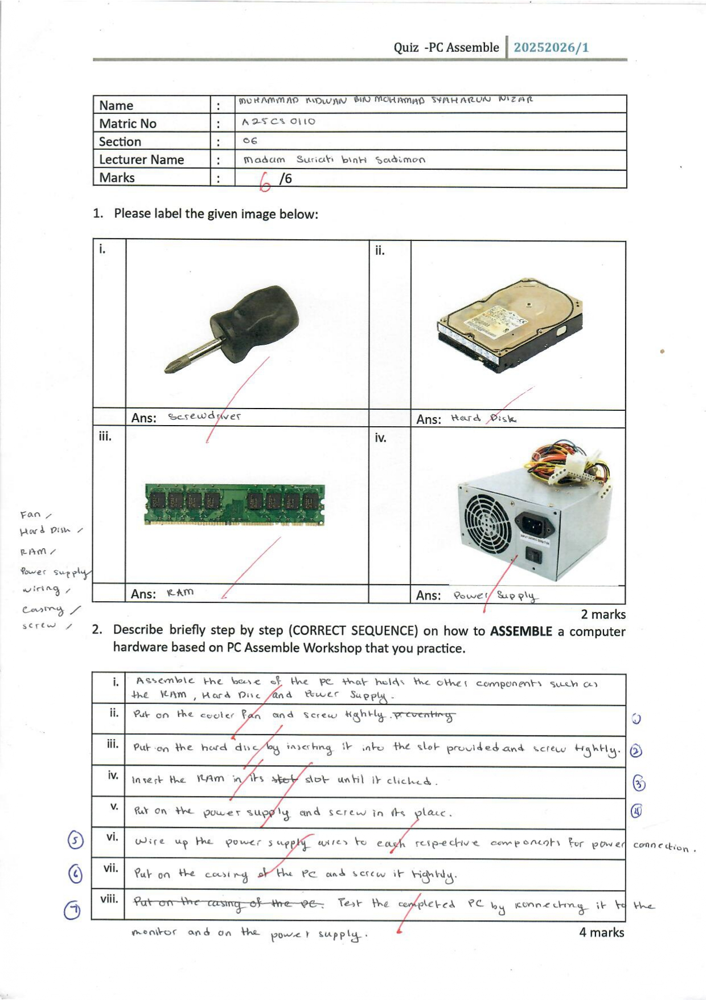

## PC Assemble | 5 November 2025

  
  

  
  

<pre>
  

    
View Quiz

    
  

</pre>

---
### Reflection
&nbsp;&nbsp;&nbsp;&nbsp;This reflection discusses my experience on assembling and disassembling a PC, which helped me to learn about several things. First, I got to identify and understand the structures and organization of the components inside the PC. In addition, I learnt the proper method for setting up the PC for usage after assembling it.

&nbsp;&nbsp;&nbsp;&nbsp;Overall, I once thought that the structure and organization of components inside the PC was complicated and hard to comprehend, but it turned out to be a misconception. It was confusing at first but once I started to observe the base structure clearly, the pattern became easily recognized. The experience taught me the importance of trying something firsthand instead of just avoiding it or giving up early.

&nbsp;&nbsp;&nbsp;&nbsp;As an improvement for the activity, a platform like Slido for Q&A or commenting session can be made to get feedback and reviews from students so that a deeper understanding can be fostered.

---
